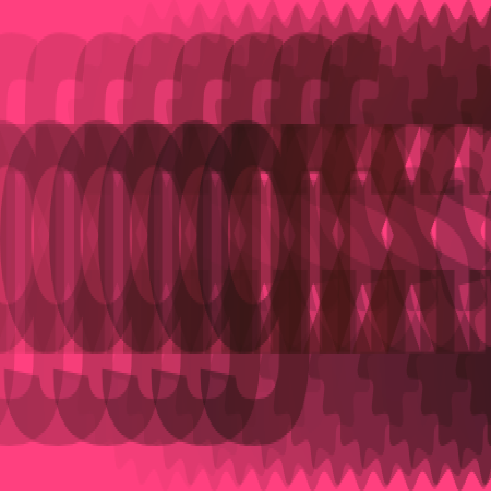
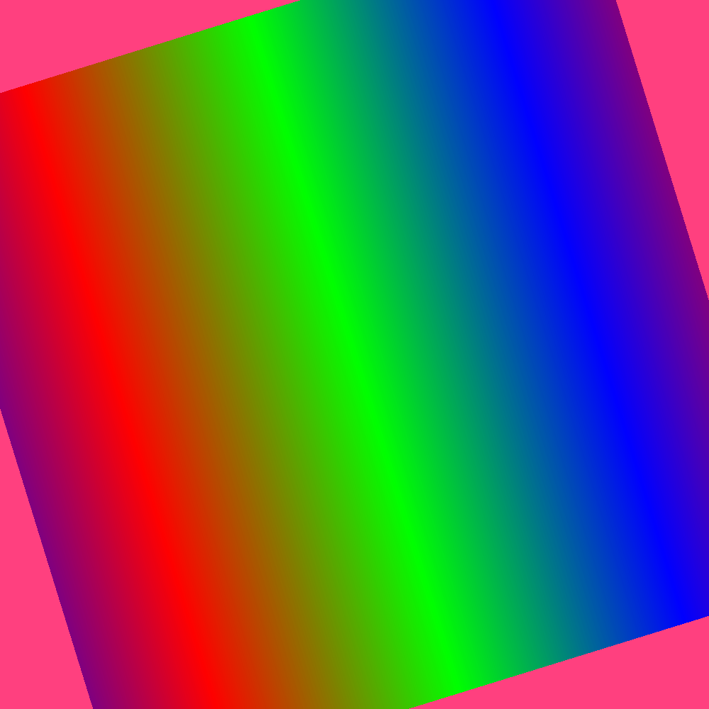
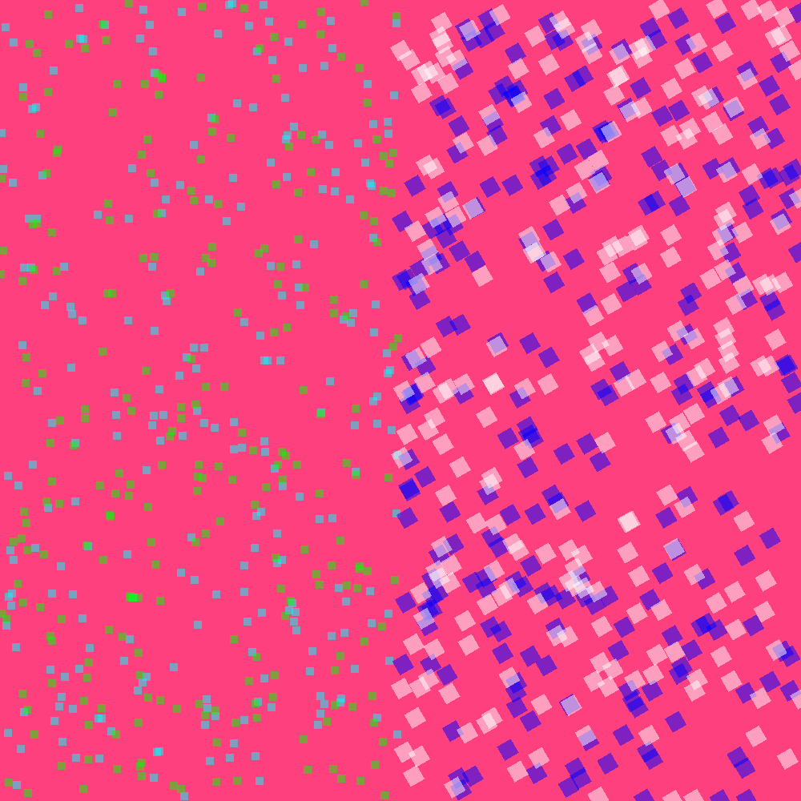

# VxDraw - Simple 2D rendering for Rust #

## Introduction ##

`vxdraw` is a rendering library for drawing sprites, text, and streaming textures to a window. It is not an engine, just a library, and has no runtime.

Note: This software is in its early stages and has only been built to satisfy the requirements of a work in progress. There will be some rough edges. Any contributions are very much welcome. Currently only Vulkan is supported as a back-end.

## Features and Motivation ##

Documentation of the API can be found on https://docs.rs/vxdraw.

`vxdraw` is made for streaming changing sprites to the GPU, and is meant mainly for video games with animated, moving, and/or deforming sprites. If no sprite changes are made, the data is not re-uploaded to the GPU for the sake of efficiency.

`vxdraw` packs data tightly to acquire near-optimal GPU-upload performance. Its main organization point is the `layer` - which defines an absolute draw ordering. A layer is a collection of the same type of drawable item, of which there are 4:

 * dyntex - Dynamic Textures, sprites based on a single texture
 * strtex - Streaming Texture, sprites based on a texture of which pixels can be edited
 * quads - Colored 4-point shape
 * text - Font rendering and letter control

And finally a pseudo-layer for debugging

 * debtri - Debug triangle, triangles that are always drawn on top of everything else. Mainly to check if something works or to implement a quick-and-dirty visual tool to check a condition in code.

Further features:

 * Custom blend modes (per-layer)
 * Filter mode (per-layer)
 * Fixed or dynamic perspective matrices (per-layer)

### Snapshot Testing ###
`vxdraw` allows for snapshot testing by retrieving the full frame data.

### Benchmark Results ###

Here are benchmark results running `cargo bench` on an AMD Vega 56 video card:

    test debtri::tests::bench_rotating_windmills_no_render                      ... bench:         855 ns/iter (+/- 77)
    test debtri::tests::bench_rotating_windmills_only                           ... bench:      57,253 ns/iter (+/- 8,600)
    test debtri::tests::bench_rotating_windmills_set_color                      ... bench:      64,500 ns/iter (+/- 25,971)
    test debtri::tests::bench_simple_triangle                                   ... bench:      50,443 ns/iter (+/- 5,055)
    test debtri::tests::bench_still_windmills                                   ... bench:      52,454 ns/iter (+/- 5,280)
    test debtri::tests::bench_windmills_set_color                               ... bench:           8 ns/iter (+/- 2)
    test dyntex::tests::animated_fireballs_20x20_uvs2                           ... bench:     114,045 ns/iter (+/- 31,969)
    test dyntex::tests::bench_many_particles                                    ... bench:      58,473 ns/iter (+/- 12,086)
    test dyntex::tests::bench_many_sprites                                      ... bench:   3,250,726 ns/iter (+/- 119,911)
    test dyntex::tests::bench_push_and_pop_sprite                               ... bench:          31 ns/iter (+/- 4)
    test dyntex::tests::bench_push_and_pop_texture                              ... bench:  55,676,043 ns/iter (+/- 56,986,205)
    test strtex::tests::adding_sprites                                          ... bench:          23 ns/iter (+/- 2)
    test strtex::tests::bench_streaming_texture_set_500x500_area                ... bench:          10 ns/iter (+/- 1)
    test strtex::tests::bench_streaming_texture_set_500x500_area_using_iterator ... bench:   2,636,501 ns/iter (+/- 374,451)
    test strtex::tests::bench_streaming_texture_set_single_pixel                ... bench:          10 ns/iter (+/- 1)
    test strtex::tests::bench_streaming_texture_set_single_pixel_while_drawing  ... bench:      65,817 ns/iter (+/- 10,654)
    test strtex::tests::generate_perlin_noise                                   ... bench:   1,895,628 ns/iter (+/- 820,344)
    test tests::clears_per_second                                               ... bench:      48,371 ns/iter (+/- 8,677)
    test text::tests::text_flag                                                 ... bench:      75,114 ns/iter (+/- 28,652)

## Example Outputs ##

* Multiple sprites of the same texture with different opacity settings

* Linear filtering mode on a 3-colored texture

* Various quads

